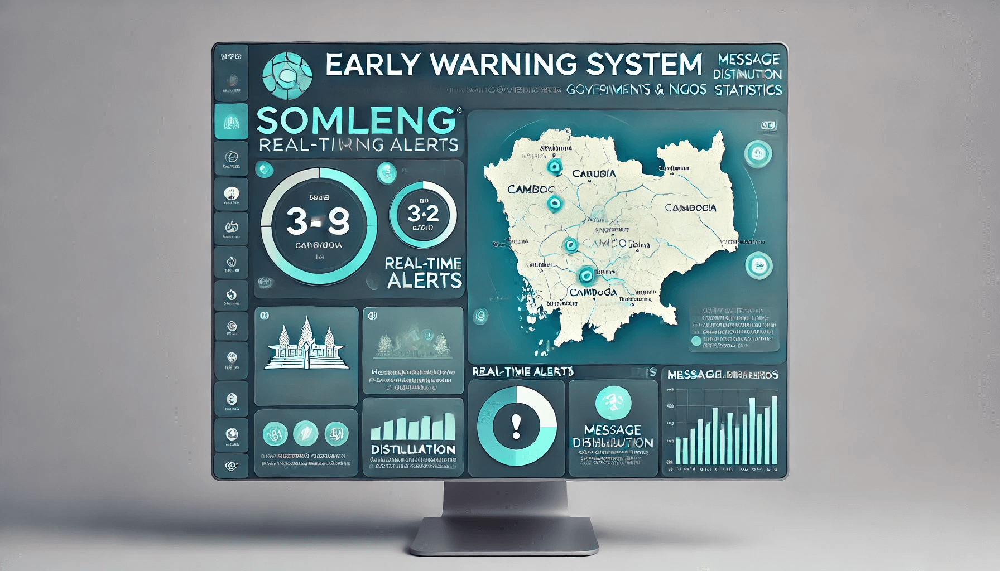

# Open Source EWS Roadmap

Our Roadmap is summarized by the following Milestones:

1. 🆘 [OpenEWS](#openews-the-worlds-first-open-source-emergency-warning-system-dissemination-dashboard)
2. 💖 [OpenEWS + Somleng](#openews--somleng)
3. 📈 [Sustainable business models for Local MNOs](#sustainable-business-models-for-local-mnos)
4. 🛖 [Community based EWS](#community-based-ews)
5. 📖 [More Info](#more-info)

## OpenEWS: The world's first Open Source Emergency Warning System Dissemination Dashboard

The [EWS4All](https://www.un.org/en/climatechange/early-warnings-for-all) initiative calls for:

> Every person on Earth to be protected by early warning systems within by 2027.

We will help to achieve this goal building and [certifying](https://www.digitalpublicgoods.net/submission-guide) OpenEWS - the world's first Open Source Emergency Warning System Dissemination Dashboard.

OpenEWS is intended to be used by Governments and/or NGOs acting on behalf of Governments to disseminate warning messages to beneficiaries in case of a natural disaster or other public health emergency.

OpenEWS will be:

* 👯‍♀️ Aesthetically Beautiful
* 🧘 Easy to use
* ញ Localizable
* 🛜 Interoperable
* 💖 Free and Open Source
* ✅ DPG Certified

## OpenEWS + Somleng

In order to deliver the emergency warning messages to the beneficiaries OpenEWS will connect to Somleng out of the box. [Somleng](https://github.com/somleng/somleng) (Part of the Somleng Project) is an Open Source, [DPG Certified](https://www.digitalpublicgoods.net/registry#:~:text=Somleng), Telco-as-a-Service (TaaS) and Communications-Platform-as-a-Service (CPaaS).

Local Mobile Network Operators (MNOs) can use Somleng to  deliver EWS messages to beneficiaries on their networks via the following channels.

* 📲 Voice Alerts (IVR)
* 💬 SMS
* 🗼 Cell Broadcast

## Sustainable Business Models for Local MNOs

In order to incentivize Local MNOs to use Somleng for the delivery of EWS messages to beneficiaries, we're developing sustainable business models which can help generate additional revenue for Local MNOs.

[Somleng's current TaaS offering](#openews--somleng) already includes a white-label Communications Platform as a Service (CPaaS) out of the box. Local MNOs can use this feature to offer their own branded CPaaS to their customers.

To illustrate how this works, let's consider a fictional dental clinic called Sore My Tooth 🦷. Sore My Tooth wants to reduce its costs and improve customer service by deploying an AI powered virtual secretary to handle dental appointments.

*Click the audio below to listen to a dental booking powered by Somleng and Retell AI.*

  

Sore My Tooth Dental Clinic has access to a branded Jazz Dashboard and API (pictured above), where they can purchase and configure phone numbers to power their AI powered secretary.

This model is a Business-to-Telco-to-Business (B2T2B) model, where:

* B1 = Somleng as a Service
* T = Jazz (Local MNO)
* B2 = Sore My Tooth Dental Clinic

In this model, Jazz (T) uses Somleng as a Service (B1) to power their branded CPaaS. Jazz (T) can then generate additional revenue by selling their phone numbers and configuring usage based billing to businesses like Sore My Tooth Dental Clinic (B2).

This model financially incentivizes local MNOs to use Somleng. Once connected, the local MNO is automatically configured for disseminating emergency messages from [OpenEWS](#openews--somleng).

## Community based EWS

While financially incentivizing Local MNOs to be apart of EWS4All can provide a solution to EWS dissemination on a national level, it's often local governments that can react more quickly to natural disasters in their jurisdictions.

For example, a Local Government Official such as a village leader could use OpenEWS to alert villagers of an impending flood or other natural disaster.

In addition, OpenEWS could also be used as a mass communication tool to organize village events or provide information to villagers. OpenEWS will be designed with this use-case in mind.

Ideally, the dissemination of EWS messages to villagers would be done through [a local MNO which is connected to Somleng](#sustainable-business-models-for-local-mnos), however setting up this arrangement can take time.

For smaller communities (such as for villages or communes), Somleng can operate in [stand-alone mode](https://www.somleng.org/docs.html#client_gateway_configuration_guide) without being connected to an MNO. This feature works by installing an inexpensive off-the-shelf piece of hardware known as a GSM gateway. The GSM gateway connects to Somleng via the Internet and contains a bank of SIM cards which are used to deliver SMS and Voice alerts to beneficiaries.

GSM Gateways require some maintenance. For example, maintainers need to ensure the gateway has a stable Internet connection as well as ensuring the installed bank of SIM cards remain active and usable in the event of an emergency.

We'll refer to the entity that maintains the GSM gateway as a "Network Provider" from now on, because their role is to provide access to the GSM Network via the GSM Gateway that they manage. This is different from to a local MNO who manages the GSM network itself. A Network Provider could be any entity from an NGO, a tech-savy individual, a small business, a community leader or an entrepreneur.

It's important to note that a Network Provider **need not** be the same entity as the entity using OpenEWS. Put another way, whilst the Network Provider and entity using OpenEWS *could* be the same entity, it's *not* a requirement. In fact, the GSM gateway doesn't even need to be installed in the location where it will be used. It only needs to be installed within the same country. This arrangement is possible because [OpenEWS](#openews-the-worlds-first-open-source-emergency-warning-system-dissemination-dashboard) is a completely separate piece of software from [Somleng](#openews--somleng).

This design feature opens a new business model. Network providers could generate revenue from providing connectivity to the GSM Network via their Gateway. To illustrate this better, let's re-consider our [dental clinic example](#sustainable-business-models-for-local-mnos) described previously.

Sore My Tooth Dental Clinic wants to deploy their AI powered virtual secretary, but they operate in a country where there is no local MNO currently connected to Somleng offering this service.

In order to fill the gap in the market, a network provider connects their GSM Gateway to Somleng, providing access to the GSM Network. Sore My Tooth Dental Clinic can sign-up for Somleng-as-a-Service directly, purchase a local phone number (managed by the Network Provider) and configure the AI powered virtual secretary. When a customer calls the phone number to make an appointment, the Network Provider's GSM Gateway forwards the call to Somleng which will initiate the AI as [previously demonstrated](#sustainable-business-models-for-local-mnos).

This model is a Business-to-Business (B2B) model, where:

* B1 = Somleng as a Service
* B2 = Sore My Tooth Dental Clinic

Notice the Network Provider, who is providing access to the GSM Network is not included in this business model? In order to financially reward the Network Provider in this model we need to develop a revenue-sharing feature and micro-payment mechanism which allows for the network provider to be paid for providing GSM access based on usage.

A Network Provider can set his/her own price for providing phone numbers GSM access on Somleng. Since payment is made from B2 to B1, a share of this revenue will be sent to the Network Provider via a micro-payments mechanism.

This model financially incentivizes individuals or NGOs to become Network Providers and work to ensure that their infrastructure is maintained. Once connected, a Network Provider's GSM Gateway is automatically configured for disseminating emergency messages from [OpenEWS](#openews--somleng).

## More Info

You can follow our progress via the project links below:

* [OpenEWS](https://github.com/orgs/somleng/projects/1)
