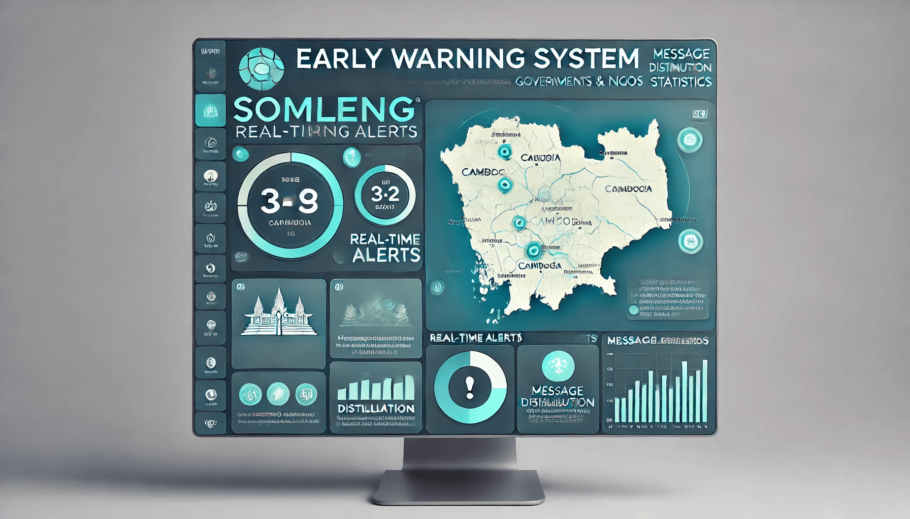
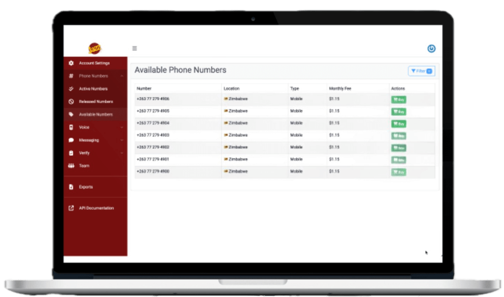

# The Somleng Project

  

## About this Repository

This repository is the entry point for The Somleng Project. The README links to the individual software components that make up Somleng. The repository also contains the source code for [somleng.org](https://www.somleng.org).

## What is Somleng?

Somleng is the world's only Open Source Telco-as-a-service (TaaS) and Cloud-communications-as-a-service (CPaaS).
With the support of UNICEF, we're helping to save lives by reaching some of the most remote and vulnerable communities around the world. [Learn more](https://www.somleng.org).

> Our vision is a world where communications is accessible to everyone.

You can use Somleng to roll out your own programmable voice and SMS to:

* 🏥 [Save lives](https://www.somleng.org/case_studies.html#early-warning-system-cambodia)
* 🧒🏽 [Improve the lives of children](https://www.somleng.org/case_studies.html#mhealth-unicef-guatemala)
* 🤑 [For fun or profit](https://www.somleng.org/case_studies.html#powering-cpaas-mexico)

## How does it work?

The diagram below shows how each component is connected together.

### Explanation

On the left hand side, applications such as [RapidPro](https://community.rapidpro.io/), [Somleng SCFM](https://github.com/somleng/somleng-scfm), Early Warning Systems, or your own custom application use [Twilio's libraries](https://www.twilio.com/docs/libraries) to connect to [Somleng's Open Source Implementation of Twilio's REST API](https://www.somleng.org/docs/twilio_api) by updating the endpoint in the helper library from `api.twilio.org` to `api.somleng.org` (or to your own URL running Somleng).

[Somleng](https://github.com/somleng/somleng) then connects to carriers, aggregators, network providers, VoIP gateways, or SMS gateways in order to make or receive calls/SMS from the telephone network via [SomlengSWITCH](https://github.com/somleng/somleng-switch) which interprets the [TwiML](https://www.twilio.com/docs/voice/twiml) (provided by the connecting application on the left) in order to control a call / SMS.

More information on the various components are listed below. More detailed information about each component can be found in the individual project repositories.

### Somleng

[Somleng](https://github.com/somleng/somleng) is an Open Source Cloud Communications Platform as a Service (CPaaS). This is the core engine of Somleng. Some features include:

* An open source implementation of Twilio's REST API for programmable voice and SMS.
* White-label(able) dashboard.

### SomlengSWITCH

[SomlengSWITCH](https://github.com/somleng/somleng-switch) is the low level switching layer for Somleng. Some features include:

* TTS engines
* Open source TwiML parser
* AI Voice Agent

### Somleng Simple Call Flow Manager (SCFM)

[Somleng Simple Call Flow Manager (SCFM)](https://github.com/somleng/somleng-scfm) is an application which can be used to connect and process calls through Somleng (or Twilio). Some features include:

* Contact management
* Callflow management

## Documentation

Below is a link to the documentation start page.

* 📚 [Documentation](https://www.somleng.org/docs.html)

## Getting Started

Follow the [Getting Started Guide](https://www.somleng.org/docs#getting-started) and run through the tutorials to learn about Somleng.

## Installation

Follow the [Installation](https://www.somleng.org/docs#installation) guide to get Somleng up and running on your local development machine.

## Deployment

The [infrastructure directory](https://github.com/somleng/somleng-project/tree/main/infrastructure/somleng) contains [Terraform](https://www.terraform.io/) configuration files in order to deploy Somleng to AWS. This repository only contains core infrastructure. Each individual component's infrastructure is in its own repository. Some of the infrastructure in this repository is a dependency of the other components and is shared using [remote state](https://www.terraform.io/language/state/remote).

## Hosting

Chatterbox Solutions offers white-labeled Somleng hosting for Carriers. Currently this service is in private beta. Please [contact us](mailto:contact@somleng.org?subject=Somleng%20Inquiry&body=Hi%2C%0D%0A%0D%0AWe're%20interested%20in%20using%20your%20hosting%20services.) for more info.

## Connect with the community

You can join at the [Discord](https://discord.gg/QdrKCW2kPx) channel for asking questions about the project or talk about Somleng with other peers.

## Roadmap

### 🆘 1. Develop the world's first Open Source Emergency Warning System Dissemination Dashboard

The [EWS4All](https://www.un.org/en/climatechange/early-warnings-for-all) initiative calls for:

> Every person on Earth to be protected by early warning systems within by 2027.

We will help to achieve this goal building and [certifying](https://www.digitalpublicgoods.net/submission-guide) the world's first Open Source Emergency Warning System Dissemination Dashboard.

The EWS Dissemination Dashboard is intended to be used by Governments and/or NGOs acting on behalf of Governments to disseminate warning messages to beneficiaries in case of a natural disaster or other public health emergency.

The EWS Dissemination Dashboard will be:

* 👯‍♀️ Aesthetically Beautiful
* 🧘 Easy to use
* ញ Localizable
* 🛜 Interoperable
* 💖 Free and Open Source
* ✅ DPG Certified

### 🔌 2. Connect the Dissemination Dashboard to Somleng

In order to deliver the emergency warning messages to the beneficiaries the EWS Dissemination Dashboard will connect to Somleng out of the box. [Somleng](https://github.com/somleng/somleng) (Part of the Somleng Project) is the world's only Open Source, [DPG Certified](https://www.digitalpublicgoods.net/registry#:~:text=Somleng), Telco-as-a-Service (TaaS) and Communications-Platform-as-a-Service (CPaaS).

Using Somleng, Local Mobile Network Operators (MNOs) can deliver emergency warning messages to beneficiaries on their networks via the following channels.

* 📲 Voice Alerts (IVR)
* 💬 SMS
* 🗼 Cell Broadcast

### 💳 3. Add billing and payments functionality to Somleng

Somleng's offering for MNOs (described above) includes a white-label Communications Platform as a Service (CPaaS) out of the box. MNOs can use this feature to offer their own branded CPaaS to their customers.

For example a dental clinic could use an MNO's branded CPaaS to build an AI powered virtual secretary to handle dental appointments:

<figure>
  <figcaption>Click the image below to listen to an appointment booking powered by Somleng's white-labeled CPaaS and Retell AI.</figcaption>
  
</figure>

MNOs can generate additional revenue by offering these types of solutions to their customers while maintaining their branding. From Somleng's perspective this is a Business-to-Telco-to-Business (B2T2B) model.

In order to financially incentivize local MNOs to use Somleng we are adding billing and payment functionality. Local MNOs will be able to automatically bill their customers and collect payment.

By onboarding with Somleng, local MNOs can generate additional revenue while supporting dissemination of warning messages generated from the EWS Dissemination Dashboard.

### 🛖 4. Support Local Governments and EWS Caretakers

While financially incentivizing Local MNOs to be apart of EWS4All can provide a solution to EWS dissemination on a national level, it's often local governments that can react more quickly to natural disasters in their jurisdictions.

For example, a Local Government Official such as a village leader could use the EWS Dissemination Dashboard to alert villagers of an impending flood or other natural disaster.

In addition, the dissemination dashboard could also be used as a mass communication tool to organize village events or provide information to villagers. The dissemination dashboard will be designed with this use-case in mind.

Ideally, the dissemination of EWS messages to villagers would be done through a local MNO which is connected to Somleng (as described above), however setting up this arrangement can take time.

For smaller EWS disseminations (such as for villages or communes), Somleng can operate in [stand-alone mode](https://www.somleng.org/docs.html#client_gateway_configuration_guide) without being connected to an MNO. This feature works by installing an inexpensive off-the-shelf piece of hardware known as a GSM gateway. The GSM gateway connects to Somleng via the Internet and contains a bank of SIM cards which are used to deliver SMS and Voice alerts to beneficiaries.

GSM Gateways require some maintenance. For example, maintainers need to ensure the gateway has a stable Internet connection as well as ensuring the installed bank of SIM cards remain active and usable in the event of an emergency.

We'll refer to the entity that maintains the GSM gateway as a "Network Provider" from now on, because they provide access to the GSM Network via the GSM Gateway that they manage. This is different from to a local MNO who manages the GSM network itself. A Network Provider could be any entity such as an NGO, a tech-savy individual, a community leader or an entrepreneur.

It's important to note that a Network Provider **need not** be the same entity as the entity using the dissemination dashboard. Put another way, whilst the Network Provider and entity using the dissemination dashboard *could* be the same entity, it's *not* a requirement. In fact, the GSM gateway doesn't even need to be installed in the location where it will be used. It only needs to be installed within the same country. This arrangement is possible because the EWS Dissemination Dashboard (described in part 1) is a completely separate piece of software from Somleng (described in part 2).

This design feature opens a new business model. Network providers could generate revenue from providing connectivity to the GSM Network via their Gateway. To illustrate this better, let's re-consider the use case described in [part 3](#add-billing-and-payments-functionality-to-somleng).

A dental clinic in Laos wants to build an AI powered virtual secretary to handle dental appointments. Unfortunately there is no local MNO in the country connected to Somleng offering this service.

In order to fill the gap in the market, a network provider connects their GSM Gateway to Somleng, providing access to the GSM Network in Laos. The dental clinic can then sign-up on Somleng directly, purchase a local phone number (managed by the Network Provider) and configure the AI powered virtual secretary. When a customer calls the phone number to make an appointment, the Network Provider's GSM Gateway forwards the call to Somleng which will initiate the AI as demonstrated in part 3.

This new model is a B2B model as opposed to a B2T2B model described in part 3. The dental clinic has a direct relationship with Somleng but no relationship with the network provider.

In order to financially reward the Network Provider in this new business model we need to develop a revenue-sharing feature and micro-payment mechanism which allows for the network provider to be paid for providing this service based on usage.

This section is about bundling those new features into Somleng.

### Learn more

To dive deeper into our roadmap and progress please refer to our [Pivotal Tracker Project](https://www.pivotaltracker.com/n/projects/2148301).

## Contributing

For carriers, network providers, or anyone who is interested in suggesting features to Somleng, feel free to join us on the [Discord channel](https://discord.gg/QdrKCW2kPx).

Currently we are moving quickly to achieve the goals stated in [our roadmap](#roadmap). While we welcome anyone who wants to contribute to Somleng we have some specific goals which we want to achieve. It's best to reach out to us on the [Discord channel](https://discord.gg/QdrKCW2kPx) first to discuss your ideas before submitting a pull request.

All final decisions about the direction of this project will be decided by the Somleng team.

## Who's sponsoring The Somleng Project?

[The Somleng Project](http://www.somleng.org) is among the first 5 start-ups to received investment from the the [UNICEF Innovation Fund](http://www.unicefstories.org/2016/11/14/somleng-open-source-telephony).

## What does Somleng mean?

Somleng (សំឡេង) means Voice in Khmer.

## Project Resources

* [Stakeholders](https://miro.com/app/board/uXjVOKklTvw=/?invite_link_id=979877928721)
* [Pitch Deck](https://tinyurl.com/somleng-investordeck)
* [Community](https://discord.gg/QdrKCW2kPx)
* [Pivotal Tracker Project](https://www.pivotaltracker.com/n/projects/2148301)

## Investors

[Pitch Deck](https://tinyurl.com/somleng-investordeck)

Special thanks to our investors:

[UNICEF Innovation Fund](https://tinyurl.com/crypto-bridge)
